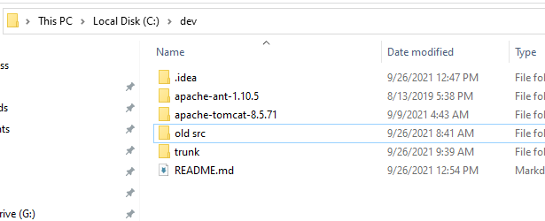
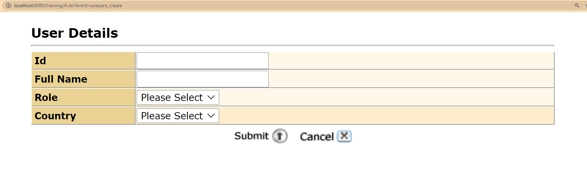
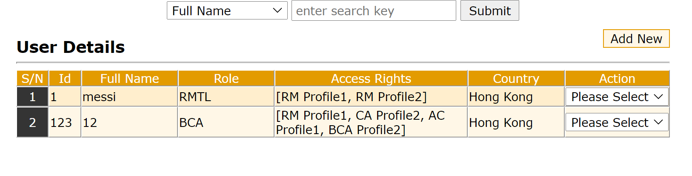
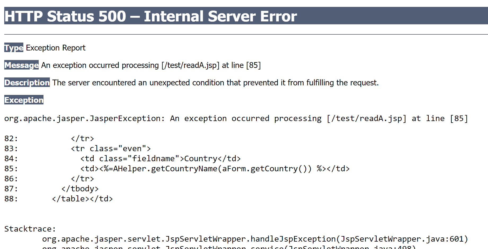
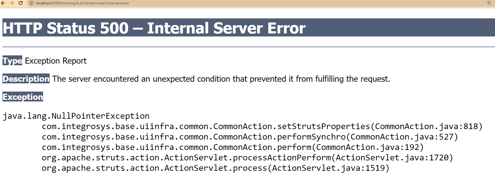

Homework OFA
===
## Training struts 1 flow

---
@author: hoanghai
### Before run cmd in trunk: dev tomcat 
Extract the Zip file in the directory C:\dev 
as all the configuration work with this directory

### What requirement I met
- Change name to full name
- Add Role
- Rights access according to role
- Create

- Edit

- Delete

### What doesn't work
- View select

- Unable to load view of search page

### My questions / problems:

1.How to create a Controller return a JSON type in Strut?
2. How to add parameter Query to URL to match with action mapping page?
3. What is the purpose of objTrx class?
4. Why not use a class extending Actions/ForwardAction/DitpatchAction to map Form to OBA and OBA to FORM easily. Purpose of this design?
5. How to connect struts to a database in a relational to maintain relation between entiry, for exp: Role and rights access? This exercise only uses AProxy as database store. But how to connect to a real DB?
6. Transactional error, how to fix this error? If I press the back button from a page and process a new request (press button). There is an alert of transactional error.
## Thank you !